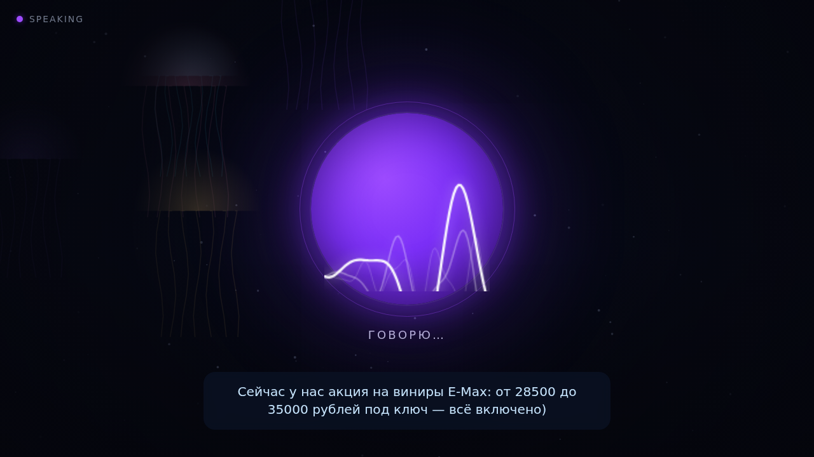

# Smile.AI — голосовой администратор стоматологии

Голосовой ассистент-администратор клиники **«Стоматология №1»** (Санкт-Петербург).
Персона — **Оливия**: встречает пациента у экрана, отвечает голосом, консультирует
по услугам и ценам, мягко ведёт к записи на **бесплатную консультацию**. Запись
оформляется через **DIKIDI** (сейчас — тестовый симулятор API, переключается на
боевой одной строкой в `.env`).

Рабочий формат — **веб-киоск**: страница открывается в браузере в полноэкранном
режиме на ТВ/мини-ПК. В простое — спокойный фон «медузы», при появлении пациента —
пульсирующий круг с аудио-волной и субтитрами.



---

## Как это устроено

```
┌─────────────── мини-ПК у телевизора ───────────────┐
│                                                     │
│  Браузер (киоск, fullscreen)                        │
│   ├─ web/  — визуал: круг + аудио-волна + медузы    │
│   ├─ микрофон → распознавание речи (STT)            │
│   └─ воспроизведение голоса Оливии (TTS)            │
│            │                                         │
│            ▼  HTTP / SSE                             │
│  src/web/server.py  (aiohttp)                        │
│   ├─ /api/message  → «мозг»: Ollama LLM | правила    │
│   ├─ /api/stt      → faster-whisper (для Firefox)    │
│   ├─ /api/tts      → Silero (локальный синтез)       │
│   └─ DikidiClient  → запись/слоты/услуги             │
│            │                                         │
│            ▼  HTTP                                   │
│  DIKIDI: тест (fake_server.py) ⇆ боевой API          │
└─────────────────────────────────────────────────────┘
```

| Слой          | Реализация                                                              |
|---------------|-------------------------------------------------------------------------|
| Визуал        | `web/` — HTML/CSS/JS: круг с аудио-волной, субтитры, процедурные медузы  |
| Голос (TTS)   | **Silero** на сервере — живой женский голос (`baya`/`xenia`); фолбэк — Piper (`ru_RU/irina`), затем `speechSynthesis` браузера |
| Слух (STT)    | Chrome/Edge — Web Speech API; Firefox — сервер (`faster-whisper`); иначе — ввод текстом |
| Мозг          | **Ollama LLM** с персоной из `config/prompts.yaml`; фолбэк — правила (`src/web/responder.py`) |
| Запись        | `src/dikidi/client.py` → тестовый `src/dikidi/fake_server.py` (или боевой DIKIDI) |
| Сервер        | `src/web/server.py` (aiohttp): статика, SSE-состояние, `/api/*`          |

Всё, что касается речи (STT/TTS), работает **локально на сервере** — голос
пациента и ответы Оливии никуда не уходят. Это важно для медицины (приватность).

---

## Быстрый старт (Docker)

```bash
cp .env.example .env

# 1) Базовый стенд — голос + тестовый DIKIDI, «мозг» на правилах
make demo

# 2) Умный стенд (рекомендуется) — + языковая модель Ollama + серверный TTS Piper
make smart
```

Открыть **http://localhost:8080**, кликнуть по экрану (браузер требует жест для
доступа к микрофону и звуку), разрешить микрофон — и говорить.

Тестовый DIKIDI API — на **http://localhost:8089** (`/healthz`, `/v1/...`).

### Два режима — в чём разница

| | `make demo` | `make smart` |
|---|---|---|
| **Мозг** | правила по ключевым словам (`responder.py`), контекст не держит | Ollama LLM — понимает свободную речь и нить диалога |
| **Голос** | `speechSynthesis` браузера | серверный **Silero** — живой женский голос (одинаковый во всех браузерах) |
| **Скачивает** | ничего | модель Ollama (~1 ГБ) + голос Silero (~50 МБ) при первом запуске |
| **Когда** | быстро глянуть визуал/логику | боевой режим, как на киоске |

### Полезные флаги

```bash
# Firefox: распознавание речи на сервере (faster-whisper)
WITH_STT=1 make smart

# модель помощнее (нужно больше RAM/GPU, русский лучше)
OLLAMA_MODEL=qwen2.5:3b make smart

# совсем шустрая модель для слабого CPU
OLLAMA_MODEL=llama3.2:1b make smart

# остановить
make demo-down      # или: make smart-down
```

Подробности, запуск без Docker, скриншоты режимов — в
**[docs/WEB_DEMO.md](docs/WEB_DEMO.md)**.

---

## Голос Оливии (TTS)

В `make smart` голос синтезирует **Silero** прямо на сервере:

- русский **живой женский** голос (`baya` — тёплый тембр, либо `xenia`/`kseniya`);
- естественная интонация и автоматические ударения (`put_accent`, `put_yo`);
- 48 кГц, одинаково звучит в Chrome и Firefox;
- работает офлайн, аудио не уходит в облако (важно для медицины).

При первом ответе модель `v4_ru` (~50 МБ) скачивается в Docker-volume
`silero_voices` и кэшируется. В логах появится `TTS: загружаю Silero v4_ru…`
→ `TTS готов`. Браузер сам спрашивает `/api/tts/status` и переключается на
серверный голос.

Настройка — переменными окружения:

```bash
SILERO_SPEAKER=baya make smart      # baya | xenia | kseniya (женские)
SILERO_SAMPLE_RATE=48000            # 8000 | 24000 | 48000
TTS_ENGINE=piper make smart         # лёгкий запасной движок без torch
```

Если `torch`/Silero недоступен — откат на Piper (`ru_RU/irina`), затем на
голос браузера.

### Живой голос с клонированием — Fish Speech / OpenAudio

Для максимально живого, эмоционального голоса (с клонированием тембра из
вашего образца) есть движок **Fish Speech** (OpenAudio S1, open-source,
Apache 2.0). Он работает полностью локально — отдельным контейнером, без
облака и API-ключей; веб-киоск обращается к нему по HTTP.

```bash
make fish        # с GPU (~4 ГБ VRAM, ответ ~1–2 с) — лучшее качество
make fish-cpu    # без GPU (медленнее, для проверки/демо)
```

Положите образец голоса в `assets/voice/` (`reference.mp3` или `.wav`,
10–15 с чистой речи) и его расшифровку в `reference.txt` — Оливия заговорит
этим голосом. Первый старт качает веса (~1 ГБ) в volume `fish_models` и
кэширует их. На время прогрева Fish автоматически работает фолбэк на Silero.

---

## Мозг Оливии (LLM)

В `make smart` подключается **Ollama** с моделью по умолчанию `qwen2.5:1.5b`
(быстрая на CPU, ~1.5–3 с на короткую реплику, хороший русский). Модель отвечает
«в роли» — персона, цены, акции и правила берутся из `config/prompts.yaml`.

Если Ollama недоступен, киоск автоматически откатывается на правиловый
`responder.py` — голос и визуал продолжают работать.

| Модель (`OLLAMA_MODEL`) | Размер | Скорость на CPU | Русский |
|---|---|---|---|
| `qwen2.5:1.5b` *(по умолчанию)* | ~1 ГБ | 1.5–3 с | хороший |
| `qwen2.5:3b` | ~2 ГБ | 5–10 с | очень хороший |
| `llama3.2:1b` | ~1 ГБ | <1 с | слабее (для слабого железа) |
| `qwen2.5:7b` | ~5 ГБ | 15–30 с (CPU) | отличный (лучше с GPU) |

Реестр Ollama иногда отдаёт `file does not exist` на манифесте — это transient,
поэтому загрузка модели ретраится до 5 раз с backoff (см. `docker-compose.smart.yml`).

---

## DIKIDI: тест → боевой

- `src/dikidi/fake_server.py` — тестовый сервер, повторяет пути боевого DIKIDI
  (услуги, врачи, свободные окна, создание/перенос/отмена записи).
- `src/dikidi/client.py` — единый клиент, которым пользуется ассистент. Работает
  и с тестовым сервером, и с боевым API **без изменений кода**.

Сейчас клиент ходит в тестовый сервер. Для боевого DIKIDI задайте в `.env`:

```env
DIKIDI_BASE_URL=https://api.dikidi.net
DIKIDI_TOKEN=ваш_токен
```

> ⚠️ Боевой API — это реальные записи пациентов. Переключайте осознанно; возможна
> правка путей/полей под фактические ответы DIKIDI.

---

## Как это работает на телевизоре

Сам ТВ обычно не запускает приложение — нужен **мини-ПК / Android-box**,
подключённый к ТВ по HDMI, USB-камера с микрофоном и колонки (или звук по HDMI):

1. На мини-ПК поднимается сервер (`make smart`).
2. Браузер открывается в полноэкранном (kiosk) режиме на `http://localhost:8080`.
3. Микрофон USB-камеры → распознавание; ответы Оливии → колонки/ТВ.
4. Камера может определять появление человека и сама начинать диалог:
   откройте `http://localhost:8080/?camera=1` (`web/camera.js`).

---

## Структура проекта

```
config/
  settings.yaml      # клиника, тайминги, модель LLM, рабочие часы
  prompts.yaml       # персона Оливии: стиль, цены, акции, правила
src/
  web/
    server.py        # aiohttp: статика, SSE, /api/*
    responder.py     # правиловый «мозг» + фильтр посторонней речи
    stt.py           # серверное распознавание (faster-whisper)
    tts.py           # серверный синтез (Silero — живой женский; Piper — запасной)
  llm/
    assistant.py     # LLM-мозг на Ollama (персона, интенты, инструменты)
    tools.py         # инструменты для LLM (слоты/запись через DIKIDI)
  dikidi/
    client.py        # клиент DIKIDI (тест и боевой)
    fake_server.py   # тестовый симулятор DIKIDI API
  dental/            # FAQ, триаж, база знаний, юмор
web/                 # фронтенд киоска (index.html, app.js, voice.js, camera.js)
docker-compose.demo.yml    # базовый стенд (web + dikidi-sim)
docker-compose.smart.yml   # надстройка: + Ollama + Silero TTS
Makefile                   # make demo / smart / test / lint
```

---

## Конфигурация

- **`config/prompts.yaml`** — персона Оливии: характер, стиль продаж, цены под
  ключ, акции, правила (удаление → партнёр-хирург, детей не лечим, время записи
  согласовывает администратор). Это «мозг» LLM.
- **`config/settings.yaml`** — данные клиники, рабочие часы (ежедневно 12:00–21:00),
  модель LLM и её параметры, UI, тайминги.
- **`.env`** — `OLLAMA_MODEL`, `DIKIDI_BASE_URL` / `DIKIDI_TOKEN`, `STT_MODEL`,
  `WITH_STT` / `WITH_TTS`.

---

## Разработка

```bash
make test     # тесты (dental + config)
make lint     # ruff (если установлен)
make clean    # очистка кэшей
```

Без Docker и тонкие настройки — в **[docs/WEB_DEMO.md](docs/WEB_DEMO.md)**.

## Логи

Диалоги пишутся в `data/logs/conversations.jsonl`, технический лог — в
`data/logs/app.log` (примонтированы наружу из контейнера).
